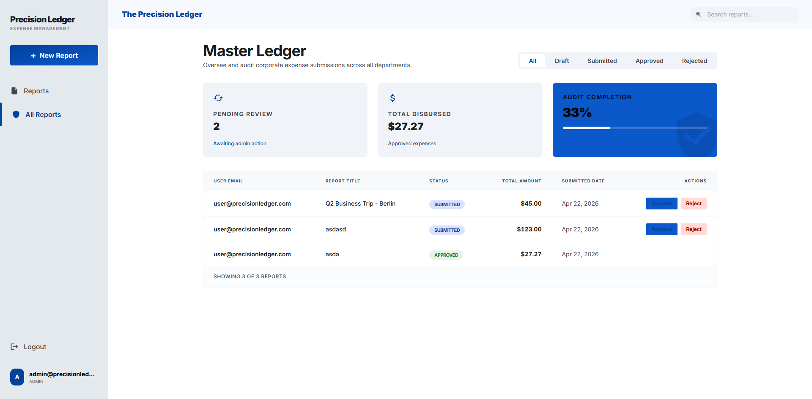

# Expense Report Management System

A full-stack expense report management system with JWT auth, state-machine-driven workflows, receipt upload with AI extraction, and admin review.



## Quick Start

```bash
# Start all services (Postgres, backend, frontend)
docker-compose up --build
```

The Dockerfile CMD automatically runs database migrations and seeds on first boot. No manual steps required.

The app will be available at:

- **Frontend:** http://localhost:5173
- **Backend API:** http://localhost:3001

### Seeded Accounts

| Role  | Email                          | Password      |
|-------|--------------------------------|---------------|
| Admin | admin@precisionledger.com      | admin123456   |
| User  | user@precisionledger.com       | user123456    |

## Running Without Docker

### Backend

```bash
cd backend
cp .env.example .env        # configure DATABASE_URL, JWT_SECRET, etc.
npm install
npx prisma migrate dev
npm run prisma:seed
npm run dev                 # starts on http://localhost:3001
```

### Frontend

```bash
cd frontend
npm install
npm run dev                 # starts on http://localhost:5173
```

The frontend proxies API requests to `http://localhost:3001` in development via Vite's proxy config.

## Environment Variables

### Backend (`backend/.env`)

| Variable          | Default                                | Description                          |
|-------------------|----------------------------------------|--------------------------------------|
| `DATABASE_URL`    | `postgresql://expenseapp:...`          | PostgreSQL connection string         |
| `JWT_SECRET`      | `dev-secret-change-in-production`      | JWT signing key (**required in production**) |
| `JWT_EXPIRES_IN`  | `7d`                                   | Token TTL                            |
| `LLM_API_KEY`     | _(empty)_                              | LLM API key; empty = mock extractor |
| `LLM_BASE_URL`    | `https://openrouter.ai/api/v1`         | OpenAI-compatible endpoint override  |
| `LLM_MODEL`       | `google/gemini-2.0-flash-001`          | LLM model to use                    |
| `UPLOAD_DIR`      | `./uploads`                            | Local receipt storage path           |
| `PORT`            | `3001`                                 | Backend port                         |

### Frontend

| Variable          | Default                    | Description              |
|-------------------|----------------------------|--------------------------|
| `VITE_API_URL`    | `http://localhost:3001`    | Backend API base URL     |

## Running Tests

```bash
cd backend
npm test               # all tests (unit + integration)
npm run test:watch     # Jest in watch mode
```

Unit tests cover the state machine transitions, service-layer business logic, and Zod validation schemas. Integration tests cover the key happy paths: full approval lifecycle, rejection/reopen cycle, item CRUD locking by report status, auth (401/403), and admin input validation.

Integration tests require a running PostgreSQL database (the Docker Compose Postgres service works, or any local instance matching `DATABASE_URL`).

## Architecture Overview

```
React SPA (Vite)  ──HTTP/REST──►  Express API  ──►  Prisma ORM  ──►  PostgreSQL
                                       │
                                       ├── multer (receipt uploads → local fs)
                                       └── OpenAI API (receipt extraction)
```

Stack: Node.js 20 + Express + TypeScript + Prisma + PostgreSQL (backend), React 18 + Vite + TypeScript + Tailwind CSS (frontend).

Key patterns:

- **Layered backend:** Routes → Controller (thin) → Service (business logic + state machine) → Prisma (data). No business logic in controllers.
- **State machine:** `DRAFT → SUBMITTED → APPROVED` (terminal). `REJECTED → DRAFT` via explicit reopen. Items locked when report is not in DRAFT.
- **Total amount:** Stored on `ExpenseReport.totalAmount`, recomputed in a Prisma transaction on every item change.
- **AI extraction:** `IExtractionService` interface with OpenAI and mock implementations. Synchronous extraction on upload. `LLM_BASE_URL` supports any OpenAI-compatible endpoint.
- **Auth:** JWT with bcrypt. RBAC middleware typed to Prisma's `Role` enum.

See `DECISIONS.md` for trade-off rationale.

## AI Tools & Workflow

This project was built under real constraints — a lot of hitting 5-hour usage limit on Z.ai Coding Plan — which forced deliberate decisions about which model handled which task. Rather than using a framework like (GetShitDone or Superpower) to orchestrate AI 
agents, all planning and prompting was done manually. The upside: deeper mental ownership of the codebase and no token overhead from framework scaffolding.The downside: as the project grew, context had to be manually re-established across sessions, which contributed to some implementation inconsistencies that required extra debugging iterations.

**On timeline:** The original plan estimated 6-8 hours with parallel 
git worktree agents running backend and frontend simultaneously. In 
practice, Coding Plan rolling rate limit prevented spawning 
more than one agent at a time — parallel execution would have doubled 
the rate limit consumption and stalled both worktrees mid-implementation. 
The decision was to run phases sequentially and use the rate limit 
resets as deliberate review checkpoints: each completed phase was 
reviewed by a separate "CTO scan" agent before moving forward. This 
added time but caught security and architecture issues earlier rather 
than compounding them across phases.

**Model routing by task type:**

- **GLM 5.1** — high-level planning, architecture exploration, generating 
  3 viable approaches to key decisions before committing. Token-expensive 
  but strong at long-horizon reasoning, state machine design, Zod validation 
  strategy, AI extraction prompt engineering, code review, and 
  DECISIONS.md reasoning. Reserved for judgment-heavy tasks..
- **GLM 4.7** — implementation counterpart to 5.1. Once architecture was 
  decided, 4.7 executed the build at lower cost.
- **GPT-5.4-mini / GitHub Copilot** — mechanical tasks when Claude was 
  rate-limited: commit scaffolding, boilerplate, CRUD stubs. No business 
  logic delegated here.

**Tooling setup:** Claude Code + OpenCode + VS Code with LSP enabled on 
both agents. LSP (Language Server Protocol) integration means agents 
validate edits in real-time and traverse code by following function 
definitions rather than grep — this meaningfully reduces hallucinated 
imports and invalid refactors without requiring manual reprompting.

**MCP used:** Playwright MCP for final end-to-end testing and README 
screenshot capture.

**Where I overrode AI output:**

- **REJECTED → DRAFT as explicit action, not implicit flip.** Claude 
  suggested auto-transitioning a report back to DRAFT silently when a 
  user edited it. Overrode to require an explicit "Reopen to Draft" 
  button — silent state changes are invisible in audit trails and 
  confusing for users who don't realize their rejected report changed 
  status.

- **Item edits require DRAFT, not just non-SUBMITTED.** Related to 
  above — Claude's initial canEditItems allowed edits in REJECTED status 
  directly. Overrode to DRAFT-only. If you want to edit items, you 
  reopen first. The state machine is explicit and traceable.

- **Multi-currency: store the field, skip the conversion.** Claude 
  suggested implementing full multi-currency conversion with an exchange 
  rate service. Overrode — conversion adds an external dependency and 
  meaningful complexity for a demo. The currency field is stored per-item 
  for future extension, but totals are summed as-is. Documented in 
  DECISIONS.md as a known limitation.

- **Fixed category enum, no free-text "other".** Claude suggested a 
  free-text category field to handle edge cases. Overrode to a fixed 
  Prisma enum with an OTHER catch-all. Free-text categories accumulate 
  inconsistent data over time ("travel", "Travel", "Travel expense") 
  — enums are filterable and consistent. If new categories emerge 
  organically, they get added as enum values with a migration.

- **Block empty report submission.** Not in the original spec. Added 
  server-side validation rejecting submissions with zero items — 
  an empty expense report has no business value and creates noise 
  for admins. Business logic enforcement belongs in the service layer 
  regardless of whether the spec calls it out explicitly.

- **Multi-provider LLM support via OpenRouter, not OpenAI-only.** 
  Claude scaffolded the extraction service hardcoded to OpenAI. 
  Overrode to an abstract IExtractionService interface with 
  configurable LLM_BASE_URL and LLM_MODEL env vars. Default routes 
  through OpenRouter to Gemini Flash — cheaper, faster, and equally 
  capable for receipt extraction. Any OpenAI-compatible endpoint works 
  with zero code changes.

**AI artifacts committed to this repo:**
- `.claude/` — Claude Code project settings and commands
- `CLAUDE.md` — project context file used across Claude sessions
- `docs/plan.md` — AI-assisted planning breakdown
- `docs/architecture.md` — AI-assisted architecture notes
- `DECISIONS.md` — all decisions documented in real-time during 
  development, including where AI output was overridden

## Project Structure

```
├── backend/
│   ├── src/
│   │   ├── config/           # env, JWT, multer config
│   │   ├── middleware/       # auth, RBAC, error handler
│   │   ├── modules/
│   │   │   ├── auth/         # signup, login
│   │   │   ├── reports/      # report CRUD + state machine
│   │   │   ├── items/        # item CRUD with status locking
│   │   │   ├── receipts/     # upload + AI extraction
│   │   │   └── admin/        # list all, approve, reject
│   │   ├── common/           # error classes, shared types
│   │   ├── app.ts            # Express setup
│   │   └── server.ts         # entry point
│   ├── prisma/               # schema, migrations, seed
│   ├── tests/
│   │   ├── unit/             # state machine, services, utils
│   │   └── integration/      # API-level tests with DB
│   └── uploads/              # receipt files (gitignored)
├── frontend/
│   ├── src/
│   │   ├── api/              # axios client + endpoint functions
│   │   ├── components/       # reusable UI components
│   │   ├── pages/            # route-level views
│   │   ├── hooks/            # custom React hooks
│   │   ├── context/          # auth context
│   │   └── types/            # TypeScript interfaces
│   └── ...
├── docs/
│   ├── architecture.md       # system design, API endpoints, testing
│   └── plan.md               # implementation phases & progress
├── stitch_expense_management_system/  # Stitch design prototypes (HTML + PNG)
├── CLAUDE.md                 # project context for AI tools
├── DECISIONS.md              # stack choices, trade-offs, "one more day"
└── docker-compose.yml        # Postgres + backend + frontend
```